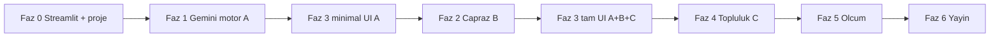

# VeritasAI — Geliştirme Görev Listesi (Faz 0 → Faz 6)

Bu plan [prd.md](./prd.md) ile uyumludur. **Üç kritik özellik** tüm sürece yayılmıştır: **(A) Güven skoru**, **(B) Çapraz doğrulama / benzer kaynaklar**, **(C) Topluluk teyidi**. Teknik omurga: **Streamlit (UI)** + **Gemini 1.5 Pro (analiz motoru)**.

Tamamlanan maddeleri işaretleyerek ilerleyin.

---

## Kritik özellik → faz eşlemesi

| PRD özelliği | Ne sağlanır | Öncelikli fazlar |
|--------------|-------------|------------------|
| **(A) Güven skoru** (0–100) + 3 gerekçe | Metin tarama, skor, gerekçeler | **Faz 1** (motor), **Faz 3** (skor kartı + detay) |
| **(B) Çapraz doğrulama** | İddiaların güvenilir ajanslarla çapraz sorgusu, “Benzer Kaynaklar” | **Faz 2** (arama + motor entegrasyonu), **Faz 3** (bölüm UI) |
| **(C) Topluluk teyidi** | Kanıt formu, loglama, “İnsan Teyidi” etiketi | **Faz 4** (form + depolama), **Faz 3** (buton + etiket görünümü) |

**Önerilen geliştirme sırası:** Faz 0 → **Faz 1 (motor iskeleti)** → **Faz 3 (minimal UI: metin + skor + gerekçeler)** → Faz 2 → Faz 3’ü tamamla → Faz 4 → Faz 5 → Faz 6.

---

## Faz 0 — Proje ve Streamlit iskeleti

**Amaç:** Çalışan bir Streamlit uygulaması ve Gemini’ye bağlanmaya hazır proje yapısı.

- [ ] Python `venv` ve `requirements.txt` (ör. `streamlit`, `google-genai` veya `google-generativeai` — seçilen resmi Gemini SDK; `python-dotenv`).
- [ ] `.env` / `.env.example`: `GEMINI_API_KEY`; `.gitignore` ile anahtar ve `venv` dışarıda.
- [ ] **Streamlit giriş noktası:** `streamlit run` ile başlayan tek dosya (ör. `app.py`) veya `app/` altında modüler yapı.
- [ ] **Önerilen klasör düzeni** (tercihinize göre sadeleştirilebilir):
  - `app.py` — sayfa akışı, `st.session_state` ile “son analiz sonucu” ve “haber parmak izi” (hash).
  - `services/gemini_client.py` — model adı, tek noktadan **Gemini 1.5 Pro** çağrıları.
  - `services/analysis.py` — **(A)** analiz motoru: metin → skor + gerekçeler (+ ileride **(B)** için yapı).
  - `data/` — **(C)** JSON/CSV itiraz dosyaları için (git’e örnek boş şablon veya `.gitkeep`).
  - `assets/` veya `styles` — özel CSS (skor kartı renkleri için).
- [ ] `README.md`: kurulum, `streamlit run app.py`, ortam değişkenleri, model adı notu.

---

## Faz 1 — Gemini 1.5 Pro analiz motoru (çekirdek: güven skoru)

**Amaç:** PRD §3.1 — **(A) Güven skoru** ve **3 ana gerekçe**; tüm uygulama bu çıktıya dayanır.

- [ ] **Model:** `gemini-1.5-pro` (veya güncel eşdeğer ad) — `services/gemini_client.py` içinde sabit veya `GEMINI_MODEL` env.
- [ ] **Prompt sözleşmesi:** Türkçe/İngilizce haber metni; çıktıda zorunlu alanlar:
  - `trust_score` (0–100 integer),
  - `reasons` (tam 3 kısa metin: örn. kaynak belirsizliği, duygusal dil, clickbait),
  - isteğe bağlı: `flags` (manipülatif dil, mantık hatası vb. etiketler).
- [ ] **Structured output:** Mümkünse JSON şeması / JSON mod ile parse; aksi halde sıkı JSON-only talimatı ve doğrulama (retry veya kullanıcıya “yeniden dene”).
- [ ] **Metin tarama kapsamı (PRD):** manipülatif dil, clickbait başlık ipuçları, mantıksal tutarsızlık — prompt’ta açık maddeler.
- [ ] **Hata ve sınır:** boş metin, token limiti, API hataları; kullanıcıya sade mesaj.
- [ ] **Streamlit bağlantısı:** `analysis.py` dönüşünü doğrudan `st.session_state["last_report"]` benzeri bir yapıya yazmayı Faz 3’te kullan.

*(Faz 1 tamamlanınca **(A)** backend tarafı üretimde; UI Faz 3’te bağlanır.)*

---

## Faz 2 — Çapraz doğrulama ve “Benzer Kaynaklar” (PRD §3.2)

**Amaç:** **(B)** Haberdeki iddiaların güvenilir kaynaklarla çapraz sorgusu; kullanıcıya referans linkleri.

- [ ] **İddia / arama sorgusu üretimi:** Gemini ile 1–3 arama dostu sorgu veya özetlenmiş iddia listesi (Faz 1’den ayrı veya birleşik çağrı — gecikmeyi kontrol et).
- [ ] **Araç seçimi:** Gemini **Grounding with Google Search** (kullanılabiliyorsa) veya **Custom Search API** / benzeri; Reuters, AP, AA vurgusu prompt veya `site:` filtre stratejisi ile.
- [ ] **Çıktı modeli:** `similar_sources[]`: `{ title, url, publisher?, snippet? }` — PRD “Benzer Kaynaklar”.
- [ ] **Çapraz sonuç → skor ilişkisi (şeffaflık):** Kaynak bulunamadığında veya çelişki varsa bunu gerekçe veya ayrı bir “çapraz bulgu” alanında göstermek (PRD şeffaflık hedefi).
- [ ] **Performans:** Tek kullanıcı akışında toplam süre **&lt; 10 sn** (PRD §6); gerekirse analiz + arama sıralaması veya tek birleşik çağrı tasarımı.

*(Faz 2 tamamlanınca **(B)** verisi `last_report` içine eklenir.)*

---

## Faz 3 — Streamlit arayüzü: ana panel, rapor, üç özelliğin birleşimi

**Amaç:** PRD §4 — tek ekranda **(A) + (B) + (C)** görünür; motor ve veri katmanına bağlı.

### Ana panel
- [ ] Büyük `st.text_area`, **“Gerçeği Sorgula”** `st.button`; tıklanınca Faz 1 (+ varsa Faz 2) pipeline çalışsın.

### Rapor paneli — **(A) Güven skoru**
- [ ] Büyük **skor kartı** (yeşil / sarı / kırmızı eşikleri — örn. ≥70 / 40–69 / &lt;40); CSS veya `st.metric` + stil.
- [ ] **Analiz detayları:** 3 gerekçe madde listesi.

### **(B) Çapraz doğrulama** görünümü
- [ ] “Benzer Kaynaklar” bölümü: tıklanabilir linkler; kaynak yoksa açıklayıcı metin.

### **(C) Topluluk teyidi** giriş noktası
- [ ] Analiz sonrası görünen **“Bu skoru hatalı mı buldunuz? Kanıt ekleyin”** — `st.expander`, `st.dialog` veya `st.form`.
- [ ] Form: güvenilir kaynak URL’si, isteğe bağlı not; gönderimde haber metninin **hash**’i ile kayıt (Faz 4).

### Oturum ve durum
- [ ] `st.session_state`: son skor, gerekçeler, benzer kaynaklar, hash; sayfa yenilense bile tutarlılık (gerekirse sınırlı).
- [ ] Yükleme: `st.spinner`; süre göstergesi veya log (Faz 5 ile uyumlu).

---

## Faz 4 — Topluluk teyidi: depolama, log ve “İnsan Teyidi” etiketi (PRD §3.3)

**Amaç:** **(C)** Kanıtların kalıcı kaydı ve raporda **“İnsan Teyidi”** göstergesi.

- [ ] **JSON veya CSV** yerel veritabanı: append-only kayıt (zaman, url, not, `content_hash`, o anki `trust_score` snapshot).
- [ ] Aynı `content_hash` için en az bir geçerli kayıt varsa **“İnsan Teyidi”** bayrağı; Faz 3 rapor kartında etiket olarak göster.
- [ ] Basit doğrulama: URL formatı; gereksiz tekrarları isteğe bağlı sınırlama.
- [ ] (İsteğe bağlı) Sidebar’da son N itirazın özeti — yarışma demosu için.

---

## Faz 5 — Kalite, ölçüm ve yarışma hazırlığı (PRD §6)

- [ ] **Süre:** uçtan uca analiz (+ isteğe bağlı arama) **10 saniye altı** — ölçüm ve darboğaz kaydı.
- [ ] **İsabet:** Türkçe örnek haber seti; **%80+** hedefi için tablo ve prompt ince ayarı.
- [ ] Demo script’i: analiz → benzer kaynak → itiraz → İnsan Teyidi (topluluk katılımı vurgusu).

---

## Faz 6 — Son rötuşlar ve dağıtım

- [ ] Yasal/etik uyarı: otomatik skor tahmini olduğu; kesin hüküm değildir.
- [ ] `requirements.txt` sabitleme; Streamlit Cloud veya yerel demo için dağıtım adımları `README.md` içinde.

---

## Bağımlılık özeti (görsel)

---

## Kontrol listesi: üç kritik özellik tamam mı?

- [ ] **(A)** 0–100 skor + 3 gerekçe hem motor hem UI’da var.
- [ ] **(B)** İddialara dayalı çapraz sorgu ve “Benzer Kaynaklar” linkleri var; boş durum şeffaf.
- [ ] **(C)** Kanıt formu, yerel log, “İnsan Teyidi” etiketi çalışıyor.

---

*Referans: [prd.md](./prd.md). Model: **Gemini 1.5 Pro**. Arayüz: **Streamlit**.*
